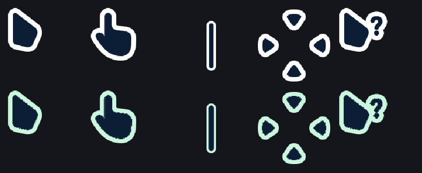
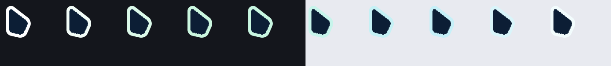
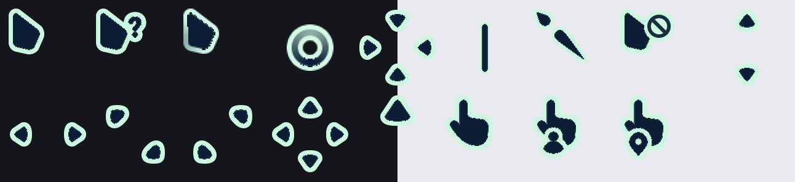

<div align="center">

# Vision Aurora

**Windows cursors whose outline never quite settles.**



Vision Black, retouched. The outline is a pixel thinner, and it drifts between
white, pastel mint and pastel cyan over eight seconds — slow enough that it is
never the thing you notice, only something you catch now and then.

The shapes are untouched.

</div>

---

## Install

**Per user, no admin rights.** Open PowerShell where you cloned it:

```powershell
.\install.ps1 vision-aurora
```

The cursors apply immediately — no sign-out, no reboot. To go back:

```powershell
.\install.ps1 -Uninstall vision-aurora
```

<details>
<summary><b>Other ways to install</b></summary>

**Right-click install** — open `packs\vision-aurora\`, right-click `install.inf`, choose
**Install**. This writes into `C:\Windows\Cursors`, so it asks for administrator rights. The
scheme then appears under Settings → Bluetooth & devices → Mouse → Additional mouse settings
→ Pointers.

**By hand** — Control Panel → Mouse → Pointers, then point each role at the matching file in
`packs\vision-aurora\`. Save it as a scheme so you can switch back.

</details>

---

## What it looks like

One loop of the pointer, ten frames, eight seconds end to end:



All 17 cursors, over a dark and a light background:



---

## Before you install it

A `.cur` file holds one still image, so a colour that moves means **every cursor has to be a
`.ani`**. That has consequences worth knowing up front:

- ⚠️ Some applications, games and remote desktop sessions **force a static cursor** and will
  simply show the first frame. You get a mint outline that never moves.
- ⚠️ Windows starts each cursor's animation when that cursor first appears, so two cursors are
  **not in sync**. Moving from the desktop to a text field can step the colour. With colours
  this pale it is hard to spot, but it is there.
- ⚠️ The pack is **21 MB**, because every frame carries all five resolutions up to 128 px.

None of this breaks anything. It is just not the same as a plain static pack.

---

## What's in it

17 cursors, every role Windows can assign:

`pointer` `help` `work` `busy` `cross` `text` `handwriting` `unavailiable` `vert` `horz`
`dgn1` `dgn2` `move` `alternate` `link` `person` `pin`

- **Five resolutions** in every file — 32, 48, 64, 96 and 128 px.
- **The original hotspots**, carried over untouched.
- **The original antialiasing.** The artwork antialiases through the alpha channel, and the
  tint is applied in proportion to how light each pixel is, so a half-blended edge pixel stays
  half-blended — it just blends toward mint instead of white.

---

## Remix it yourself

The tool that made this pack works on **any** folder of `.cur` / `.ani` files:

```bash
npm install
node src/remix.mjs "path/to/some/cursor/pack" output-name
```

It reads every cursor, erodes one ring of outline pixels from the inner side, tints what is
left through a colour loop, and writes a new animated pack plus its installer manifest.

Two things it works out on its own rather than assuming:

- **The fill colour**, sampled from the artwork. This pack's fill is dark navy, not black —
  hardcoding black would have left speckles wherever the outline was eroded.
- **How much of a pixel is outline**, from its brightness, so antialiased edges survive.

Change the colours in one place, `OUTLINE_CYCLE` in `src/themes.mjs`:

```js
export const OUTLINE_CYCLE = ['#FFFFFF', '#C9F7DE', '#C4F0F8'];
```

Any number of anchors works; the loop always closes back to the first.

Preview a built pack with `node src/sheet.mjs vision-aurora`.

| File | Role |
|---|---|
| `src/remix.mjs` | Retouches an existing pack |
| `src/lib/retouch.mjs` | The outline thinning and tinting |
| `src/lib/cycle.mjs` | The colour loop, eased at each anchor |
| `src/lib/read.mjs` | `.cur` / `.ani` readers |
| `src/lib/cur.mjs` | `.cur` writer |
| `src/lib/ani.mjs` | `.ani` writer (RIFF/ACON) |
| `src/build.mjs` | Draws a pack from scratch, from the SVG shapes in `src/shapes.mjs` |

---

## Credit

The original **Vision Black** artwork is mine, published earlier under the name Darques.
This repository is that pack retouched, with the tooling that did it.

## Licence

[MIT](LICENSE) — use them, change them, ship them. Attribution welcome, not required.
