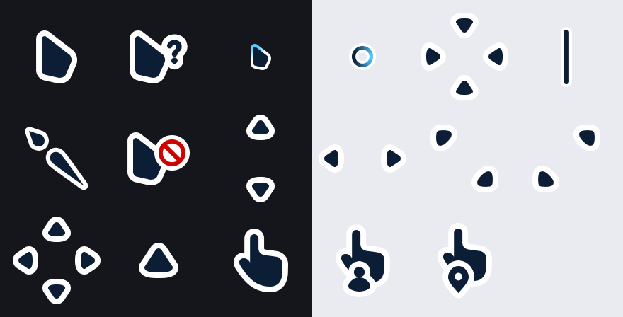

<div align="center">

# Vision Black

**A rounded, minimal, dark cursor pack for Windows.**



Seventeen cursors, two of them animated, five resolutions each.

</div>

---

## Install

### 📥 [Download Vision-Black.zip](../../releases/latest)

Unzip it, **double-click `install.bat`**. That is the whole thing.

It copies the cursors into your own user folder and switches to them straight away — no
administrator rights, no restart. `uninstall.bat` puts the Windows defaults back.

> If nothing happens when you run it: Windows blocks files that came from the internet.
> Right-click `install.bat` → Properties → tick **Unblock** at the bottom → try again.

<details>
<summary><b>Other ways to install</b></summary>

**Right-click install** — right-click `install.inf`, choose **Install**. This one writes into
`C:\Windows\Cursors`, so it asks for administrator rights. The scheme then appears under
Settings → Bluetooth & devices → Mouse → Additional mouse settings → Pointers.

**From a clone** — open PowerShell in the repository root:

```powershell
.\install.ps1 vision-black
```

To go back: `.\install.ps1 -Uninstall vision-black`

**By hand** — Control Panel → Mouse → Pointers, then point each role at the matching file in
`packs\vision-black\`. Save it as a scheme so you can switch back.

</details>

---

## What's in it

Every role Windows can assign:

`pointer` `help` `work` `busy` `cross` `text` `handwriting` `unavailiable` `vert` `horz`
`dgn1` `dgn2` `move` `alternate` `link` `person` `pin`

- **Five resolutions** in every cursor — 32, 48, 64, 96 and 128 px, so it stays sharp at any
  cursor size and on any DPI.
- **Two animated cursors** — the busy spinner and the working-in-background pointer.
- **2.3 MB** for the pack, 100 KB zipped.

---

## The tooling

Three scripts, no dependencies — plain Node, nothing to install.

```bash
node src/adopt.mjs "path/to/cursors" pack-name "Display Name"
npm run preview      # rebuilds the sheet above
npm run zip          # rebuilds the download
```

`adopt.mjs` takes any folder of `.cur` / `.ani` files and packages it: it copies the cursors
byte for byte and adds what Windows needs to install them — a manifest for the PowerShell
installer and a generated `install.inf` for the right-click route.

| File | Role |
|---|---|
| `install.ps1` | Per-user installer; works from a clone or from inside an unzipped pack |
| `src/adopt.mjs` | Packages a folder of cursors |
| `src/sheet.mjs` | Renders the preview sheet from the shipped files, not from a source drawing |
| `src/zip.mjs` | Builds the download, with `install.bat` and a plain text readme |
| `src/lib/read.mjs` | `.cur` / `.ani` readers |
| `src/lib/cur.mjs` | `.cur` writer |
| `src/lib/ani.mjs` | `.ani` writer (RIFF/ACON) |
| `src/lib/inf.mjs` | Generates `install.inf` |
| `src/lib/png.mjs` | Minimal PNG writer, for the preview sheets |

The preview sheet is built from the shipped cursor files rather than from any source artwork,
so what you see above is exactly what installs.

---

## Licence

[MIT](LICENSE) — use them, change them, ship them. Attribution welcome, not required.
